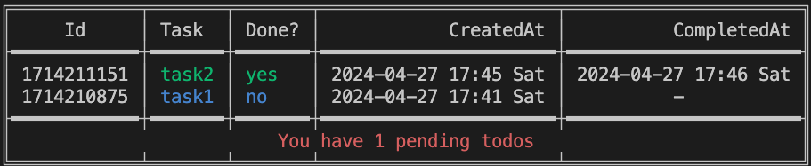

# go-tdlist

This is a simple command-line interface (CLI) program written in Golang for managing your todo list.

## Features

- Add new tasks to your todo list.
- Mark tasks as complete.
- View your todo list with date range.
- Delete tasks from your todo list.

## Usage
### Build and run with your golang environment
After clone the project.
```
go install
go build -o tdlist  cmd/go-tdlist/main.go
```

Execute it with following commands.
```
./tdlist --help

Usage of ./tdlist:
  -add
        Add a new todo
  -complete int
        Toggle todo completion
  -del int
        Delete a todo
  -end_date string
        End date
  -list
        List all todos by date range, default is today
  -start_date string
        Start date
```

Operations
#### Add: Add a new todo
./tdlist -add

Add a todo task:
task1
#### Complete: Toggle todo completion
```
./tdlist -complete [id]
```
#### Delete: Delete a todo
```
./tdlist -del [id]
```

#### List: List all todos by date range, default is today
```
./tdlist -list
```
<p align="center">
  
</p>
<br>

